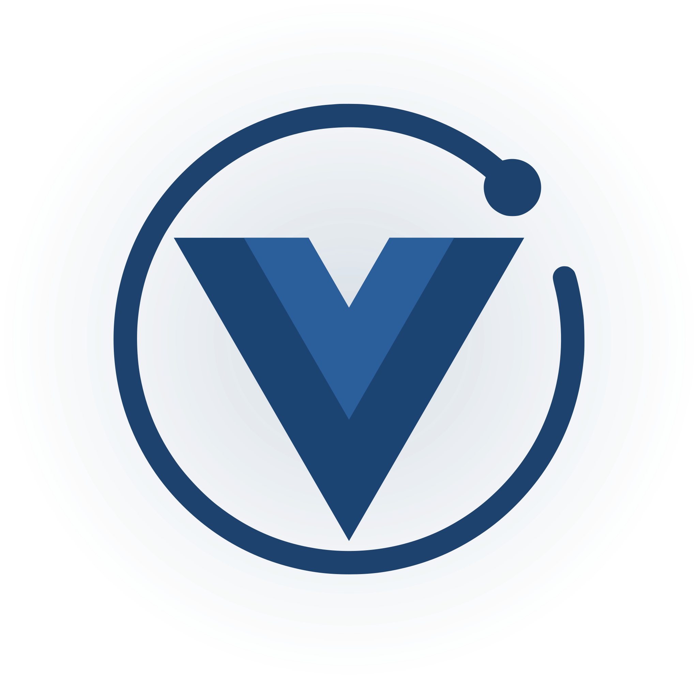

  

# Apollo and GraphQL for Vue.js

:book: [Documentation](http://apollo.vuejs.org)

[:pen: Contributing guide](./CONTRIBUTING.md)

[:heart: Sponsor me!](https://github.com/sponsors/Akryum)

## Continuous Releases

You can install builds from any commit on the main branch from [here](https://nightly.akryum.dev/vuejs/vue-apollo) or from any Pull Request.

## Monorepo

In this monorepository:

| Package | Description |
|---------|-------------|
|[@vue/apollo-composable](./packages/vue-apollo-composable) |Composition API|
|[@vue/apollo-option](./packages/vue-apollo-option)         |Options API|
|[@vue/apollo-components](./packages/vue-apollo-components) |Components with slots|
|[@vue/apollo-ssr](./packages/vue-apollo-ssr) |Server-Side Rendering Utils|
|[@vue/apollo-util](./packages/vue-apollo-util) |Other Utils|

## Sponsors

  

